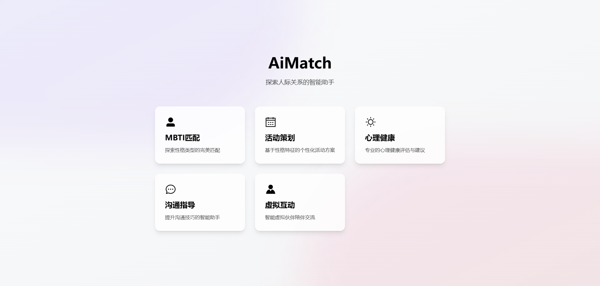
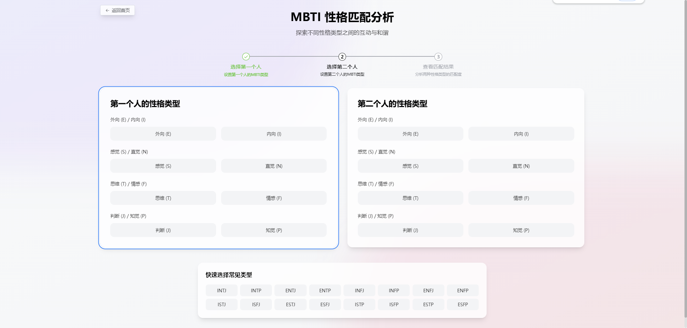
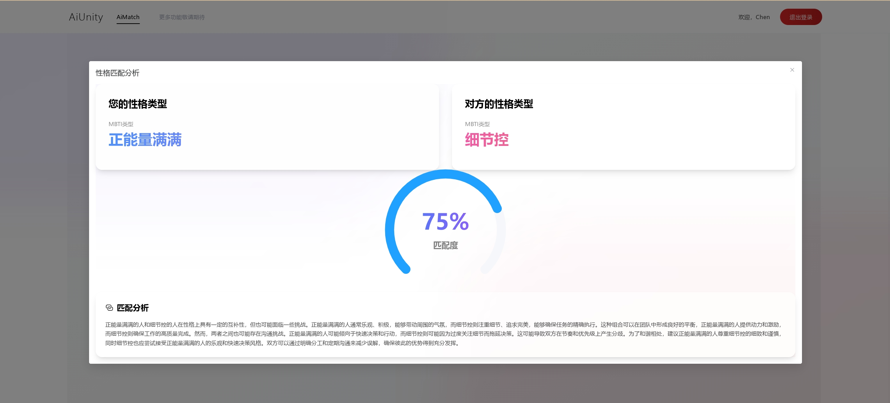
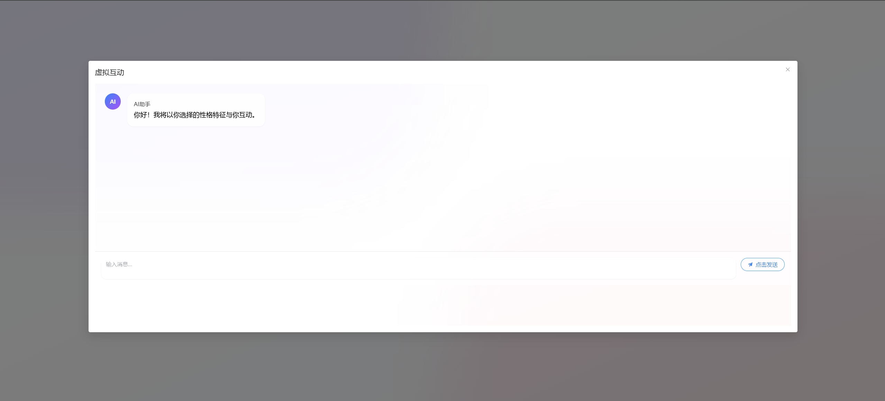
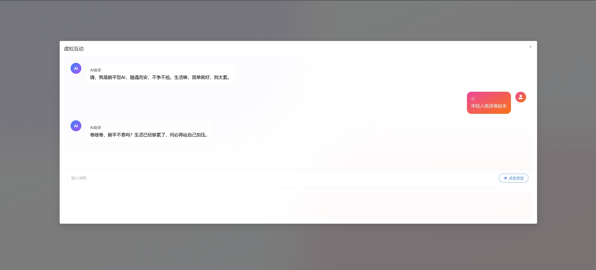

# AiMatch - MBTI 性格匹配系统
#系统访问地址
http://117.72.43.183/

## 项目简介

AiMatch 是一个创新的性格匹配分析系统，它结合了人工智能，为用户提供专业的性格匹配分析服务。系统通过直观的界面让用户选择性格类型，并利用 AI 大模型进行深度分析，给出详细的匹配报告。除了性格匹配分析外，系统还提供了独特的虚拟聊天功能，让用户能够与不同性格类型的AI角色进行对话交流，帮助用户更深入地理解不同性格特征的思维方式和沟通模式。

## 核心功能

- 📊 性格类型选择与展示
- 🤖 AI 驱动的性格匹配分析
- 💬 AI 虚拟角色聊天互动
- 💫 动态匹配结果展示
- 📱 响应式界面设计
- 🎨 现代化 UI/UX 体验

## 系统页面预览







## 技术栈

### 前端
- Vue 3 - 渐进式 JavaScript 框架
- Vite - 下一代前端构建工具
- Tailwind CSS - 实用优先的 CSS 框架

### 后端
- Deepseek API - AI 分析引擎

## 系统要求

- Node.js >= 14
- npm >= 6
- 现代浏览器（Chrome、Firefox、Safari、Edge 等）

## 快速开始

### 1. 克隆项目
```bash
git clone https://gitee.com/CHENNBOO/AiMatch
cd AiMatch
```

### 2. 安装依赖
```bash
# 安装前端依赖
npm install
```

### 3. 环境配置
```bash
# 配置环境变量
cp .env.example .env
```
在 `.env` 文件中配置以下信息：
- VITE_API_BASE_URL：API服务器地址

### 4. 启动服务
```bash
npm run dev
```


